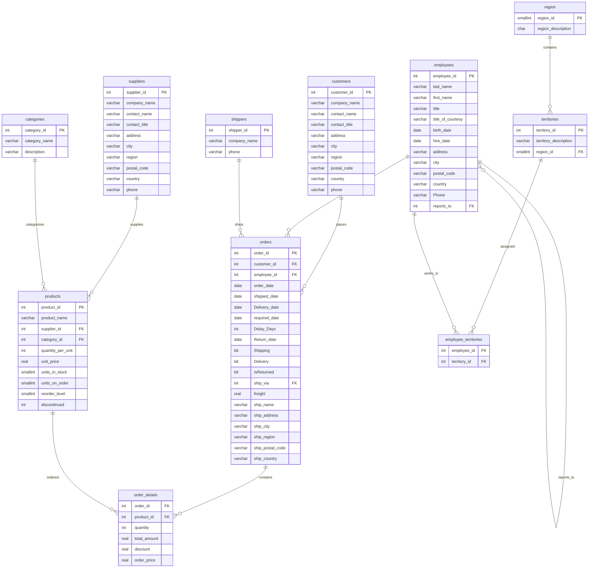
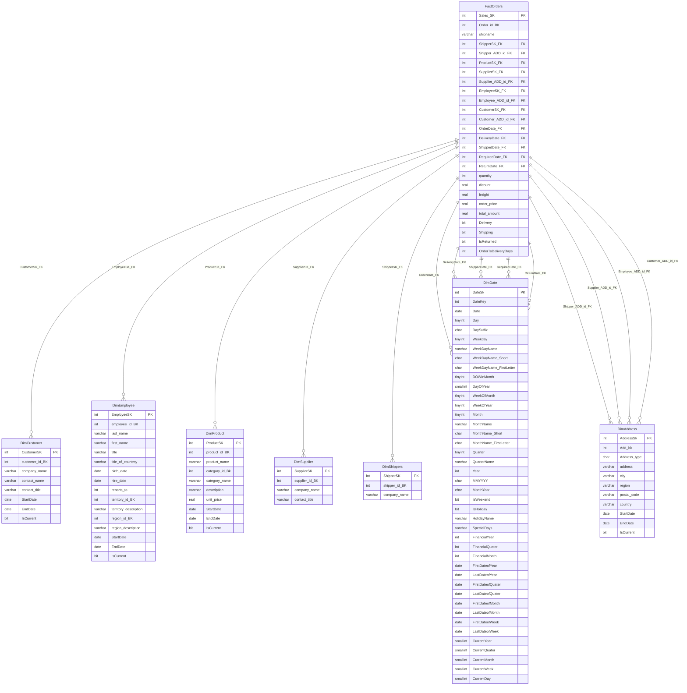

# Database Schema Documentation

## OLTP Source System Schema

```mermaid
erDiagram
    categories {
        int category_id PK
        varchar category_name
        varchar description
    }

    customers {
        int customer_id PK
        varchar company_name
        varchar contact_name
        varchar contact_title
        varchar address
        varchar city
        varchar region
        varchar postal_code
        varchar country
        varchar phone
    }

    employees {
        int employee_id PK
        varchar last_name
        varchar first_name
        varchar title
        varchar title_of_courtesy
        date birth_date
        date hire_date
        varchar address
        varchar city
        varchar postal_code
        varchar country
        varchar Phone
        int reports_to FK
    }

    products {
        int product_id PK
        varchar product_name
        int supplier_id FK
        int category_id FK
        int quantity_per_unit
        real unit_price
        smallint units_in_stock
        smallint units_on_order
        smallint reorder_level
        int discontinued
    }

    suppliers {
        int supplier_id PK
        varchar company_name
        varchar contact_name
        varchar contact_title
        varchar address
        varchar city
        varchar region
        varchar postal_code
        varchar country
        varchar phone
    }

    shippers {
        int shipper_id PK
        varchar company_name
        varchar phone
    }

    orders {
        int order_id PK
        int customer_id FK
        int employee_id FK
        date order_date
        date shipped_date
        date Delivery_date
        date required_date
        int Delay_Days
        date Return_date
        bit Shipping
        bit Delivery
        bit IsReturned
        int ship_via FK
        real freight
        varchar ship_name
        varchar ship_address
        varchar ship_city
        varchar ship_region
        varchar ship_postal_code
        varchar ship_country
    }

    order_details {
        int order_id FK
        int product_id FK
        int quantity
        real total_amount
        real discount
        real order_price
    }

    territories {
        int territory_id PK
        varchar territory_description
        smallint region_id FK
    }

    region {
        smallint region_id PK
        char region_description
    }

    employee_territories {
        int employee_id FK
        int territory_id FK
    }

    %% Relationships
    customers ||--o{ orders : "places"
    employees ||--o{ orders : "processes"
    orders ||--o{ order_details : "contains"
    products ||--o{ order_details : "ordered"
    suppliers ||--o{ products : "supplies"
    categories ||--o{ products : "categorizes"
    shippers ||--o{ orders : "ships"
    region ||--o{ territories : "contains"
    territories ||--o{ employee_territories : "assigned"
    employees ||--o{ employee_territories : "works_in"
    employees ||--o{ employees : "reports_to"
```

## Data Warehouse Schema

```mermaid
erDiagram
    DimDate {
        int DateSk PK
        int DateKey
        date Date
        tinyint Day
        char DaySuffix
        tinyint Weekday
        varchar WeekDayName
        char WeekDayName_Short
        char WeekDayName_FirstLetter
        tinyint DOWInMonth
        smallint DayOfYear
        tinyint WeekOfMonth
        tinyint WeekOfYear
        tinyint Month
        varchar MonthName
        char MonthName_Short
        char MonthName_FirstLetter
        tinyint Quarter
        varchar QuarterName
        int Year
        char MMYYYY
        char MonthYear
        bit IsWeekend
        bit IsHoliday
        varchar HolidayName
        varchar SpecialDays
        int FinancialYear
        int FinancialQuater
        int FinancialMonth
        date FirstDateofYear
        date LastDateofYear
        date FirstDateofQuater
        date LastDateofQuater
        date FirstDateofMonth
        date LastDateofMonth
        date FirstDateofWeek
        date LastDateofWeek
        smallint CurrentYear
        smallint CurrentQuater
        smallint CurrentMonth
        smallint CurrentWeek
        smallint CurrentDay
    }

    DimCustomer {
        int CustomerSK PK
        int customer_id_BK
        varchar company_name
        varchar contact_name
        varchar contact_title
        date StartDate
        date EndDate
        bit IsCurrent
    }

    DimEmployee {
        int EmployeeSK PK
        int employee_id_BK
        varchar last_name
        varchar first_name
        varchar title
        varchar title_of_courtesy
        date birth_date
        date hire_date
        int reports_to
        int territory_id_BK
        varchar territory_description
        int region_id_BK
        varchar region_description
        date StartDate
        date EndDate
        bit IsCurrent
    }

    DimProduct {
        int ProductSK PK
        int product_id_BK
        varchar product_name
        int category_id_Bk
        varchar category_name
        varchar description
        real unit_price
        date StartDate
        date EndDate
        bit IsCurrent
    }

    DimSupplier {
        int SupplierSK PK
        int supplier_id_BK
        varchar company_name
        varchar contact_title
    }

    DimShippers {
        int ShipperSK PK
        int shipper_id_BK
        varchar company_name
    }

    DimAddress {
        int AddressSk PK
        int Add_bk
        char Address_type
        varchar address
        varchar city
        varchar region
        varchar postal_code
        varchar country
        date StartDate
        date EndDate
        bit IsCurrent
    }

    FactOrders {
        int Sales_SK PK
        int Order_id_BK
        varchar shipname
        int ShipperSK_FK FK
        int Shipper_ADD_id_FK FK
        int ProductSK_FK FK
        int SupplierSK_FK FK
        int Supplier_ADD_id_FK FK
        int EmployeeSK_FK FK
        int Employee_ADD_id_FK FK
        int CustomerSK_FK FK
        int Customer_ADD_id_FK FK
        int OrderDate_FK FK
        int DeliveryDate_FK FK
        int ShippedDate_FK FK
        int RequiredDate_FK FK
        int ReturnDate_FK FK
        int quantity
        real dicount
        real freight
        real order_price
        real total_amount
        bit Delivery
        bit Shipping
        bit IsReturned
        int OrderToDeliveryDays
    }

    %% Relationships from Fact Table to Dimensions
    FactOrders ||--o{ DimCustomer : CustomerSK_FK
    FactOrders ||--o{ DimEmployee : EmployeeSK_FK
    FactOrders ||--o{ DimProduct : ProductSK_FK
    FactOrders ||--o{ DimSupplier : SupplierSK_FK
    FactOrders ||--o{ DimShippers : ShipperSK_FK
    FactOrders ||--o{ DimDate : OrderDate_FK
    FactOrders ||--o{ DimDate : DeliveryDate_FK
    FactOrders ||--o{ DimDate : ShippedDate_FK
    FactOrders ||--o{ DimDate : RequiredDate_FK
    FactOrders ||--o{ DimDate : ReturnDate_FK
    
    %% Address relationships
    FactOrders ||--o{ DimAddress : Shipper_ADD_id_FK
    FactOrders ||--o{ DimAddress : Supplier_ADD_id_FK
    FactOrders ||--o{ DimAddress : Employee_ADD_id_FK
    FactOrders ||--o{ DimAddress : Customer_ADD_id_FK
```